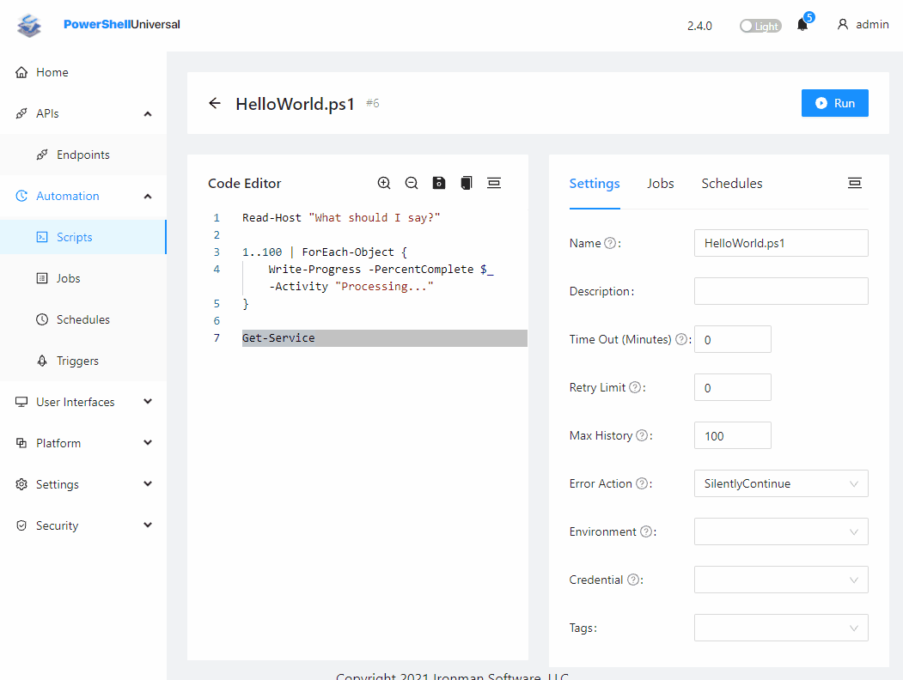

# Get Started

## Install PowerShell Universal

You'll need to install the PowerShell Universal server. [There are a lot of ways to do so](getting-started/) but you can use the command line below to get started quickly.



You can install PowerShell Universal as a service. Ensure that PowerShell is running as administrator or the service won't install correctly.&#x20;

```powershell
Install-Module Universal
Install-PSUServer
```



You can learn more about [desktop mode here](https://docs.powershelluniversal.com/desktop/about-desktop-mode).



You can install PowerShell Universal using the following shell script.

```
Install-Module Universal
Install-PSUServer
```



You can install PowerShell Universal using the Universal PowerShell module.

```
Install-Module Universal
Install-PSUServer -AddToPath
Start-PSUServer -Port 5000
```



```
wget https://imsreleases.blob.core.windows.net/universal/production/2.4.0/Universal.linux-arm.2.4.0.zip
unzip Universal.linux-arm.2.3.2.zip -d ./PSU
chmod +x ./PSU/Universal.Server
./PSU/Universal.Server

```



## Open PowerShell Universal

By default, PowerShell Universal is running on port 5000 of localhost. You can access the admin console with the username `admin` and `admin`.

.png>)

## Create an API

APIs allow you to call PowerShell scripts over HTTP. To create an API, click API \ Endpoints and click Create New Endpoint. Specify a URL.&#x20;

.png>)

Next, click details on the API that was created an enter the following command into the editor.&#x20;

```
Get-ComputerInfo
```

Save the script and then click the Execute button to test it out.&#x20;

.png>)

You can also execute the API via `Invoke-RestMethod`.&#x20;

```
PS C:\Users\adamr> Invoke-RestMethod http://localhost:5000/hello-world

WindowsBuildLabEx                                       : 22000.1.amd64fre.co_release.210604-1628
WindowsCurrentVersion                                   : 6.3
WindowsEditionId                                        : Professional
WindowsInstallationType                                 : Client
WindowsInstallDateFromRegistry                          : 8/6/2021 4:05:12 PM
WindowsProductId                                        : 00330-52452-93139-AAOEM
WindowsProductName                                      : Windows 10 Pro
WindowsRegisteredOrganization                           :
```

## Create a Script

To create a script, click Automation \ Scripts and then click Create New Script.&#x20;

.png>)

Enter the following script into the editor and save.&#x20;

```powershell
Read-Host "What should I say?"

1..100 | ForEach-Object {
    Write-Progress -PercentComplete $_ -Activity "Processing..."
}

Get-Service
```

Once the script is saved, click Run.&#x20;



## Create an App

To create a new PowerShell-based user interface (app), you can click User Interfaces \ Apps and then Create New App.&#x20;

.png>)

After clicking Ok, click the Details button to edit the PowerShell script. Add the following script to the editor.

```powershell
New-UDApp -Title "Hello, World!" -Content {
    New-UDButton -Text "Click Me" -OnClick {
        Show-UDToast -Message 'Success!!'
    }
}
```

Save the app, click the Restart button and then click the View button. Click the Click Me button.&#x20;

.png>)

Learn more about the various features of PowerShell Universal

* [APIs](api/about.md)
* [Automation](automation/about.md)
* [Apps](userinterfaces/building-dashboards.md)
