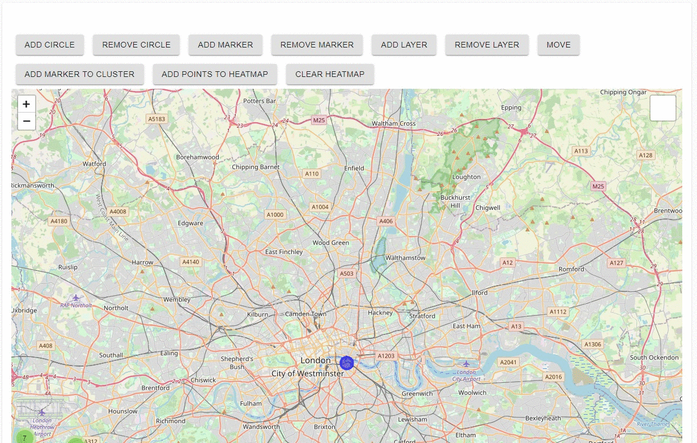

# Map

The UDMap component is a robust control that provides a huge set of features. You can select base layers, configure togglable layers, set markers, define vectors and interact with other Universal App components.

## Basic Map

This basic map defines a simple base layer using the wmflabs.org tile server. You can use your own custom tile server by specifying a URL. The map is position over Hailey, Idaho.

```powershell
New-UDMap -Endpoint {
    New-UDMapRasterLayer -TileServer 'https://tiles.wmflabs.org/bw-mapnik/{z}/{x}/{y}.png' 
} -Latitude 43.52107 -Longitude -114.31644 -Zoom 13 -Height '100vh'
```

.png>)

## Layer Control

You can enable the layer control by using the `New-UDMapLayerControl` cmdlet. This map defines several layers with components that you can toggle on and off. You can only have one base layer selected as a time. Map overlay layers can toggle on and off.

```powershell
New-UDMap -Endpoint {
    New-UDMapLayerControl -Content {
        New-UDMapBaseLayer -Name 'Black and White' -Content {
            New-UDMapRasterLayer -TileServer 'https://tiles.wmflabs.org/bw-mapnik/{z}/{x}/{y}.png' 
        } -Checked
        New-UDMapBaseLayer -Name 'Color' -Content {
            New-UDMapRasterLayer -TileServer 'https://{s}.tile.openstreetmap.org/{z}/{x}/{y}.png' 
        }
        New-UDMapOverlay -Name 'Marker' -Content {
            New-UDMapMarker -Latitude 51.505 -Longitude -0.09 
        } -Checked
        New-UDMapOverlay -Name 'Marker 2' -Content {
            New-UDMapMarker -Latitude 51.555 -Longitude -0.00 
        } -Checked
    }
} -Latitude 51.505 -Longitude -0.09 -Zoom 13 -Height '100vh'
```

.png>)

## Markers

Markers are used to highlight particular locations.&#x20;

```powershell
New-UDMap -Endpoint {
    New-UDMapRasterLayer -TileServer 'https://{s}.tile.openstreetmap.org/{z}/{x}/{y}.png' 
    New-UDMapMarker -Latitude "51.100" -Longitude "-0.5"
} -Latitude 51.505 -Longitude -0.09 -Zoom 13 -Height '100vh'
```

### Custom Icons

You can specify custom icons for markers using the `-Icon` parameter.&#x20;


```powershell
New-UDMap -Endpoint {
    New-UDMapRasterLayer -TileServer 'https://{s}.tile.openstreetmap.org/{z}/{x}/{y}.png' 
    New-UDMapMarker -Latitude "51.100" -Longitude "-0.5"
} -Latitude 51.505 -Longitude -0.09 -Zoom 13 -Height '100vh' -Icon (New-UDMapIcon -Url = "https://ironmansoftware.com/img/ps-logo.png")
}
```


### Popups&#x20;

You can create a popup when clicking the marker by using the `-Popup` parameter and the `New-UDMapPopup` cmdlet.&#x20;

```powershell
New-UDMapMarker -Latitude "51.$RandomLat" -Longitude "-0.$Random" -Popup (
    New-UDMapPopup -Content {
        New-UDAlert -Text "Hello"
    } -MinWidth 200
)
```

## Heatmaps

Heatmaps can be defined by creating a heatmap layer. The intesity and location of the heatmap clusters can be defined by using the `New-UDMapHeatmapLayer` cmdlet.

```powershell
New-UDMap -Endpoint {
    New-UDMapRasterLayer -TileServer 'https://{s}.tile.openstreetmap.org/{z}/{x}/{y}.png' 
    New-UDMapHeatmapLayer -Points @(
        @(-37.9019339833, 175.3879181167, "625"),
        @(-37.90920365, 175.4053418167, "397"),
        @(-37.9057407667, 175.39478875, "540"),
        @(-37.9243174333, 175.4220341833, "112"),
        @(-37.8992012333, 175.3666729333, "815"),
        @(-37.9110874833, 175.4102195833, "360"),
        @(-37.9027096, 175.3913196333, "591"),
        @(-37.9011183833, 175.38410915, "655"),
        @(-37.9234701333, 175.4155696333, "181"),
        @(-37.90254175, 175.3926162167, "582"),
        @(-37.92450575, 175.4246711167, "90"),
        @(-37.9242924167, 175.4289432833, "47"),
        @(-37.8986079833, 175.3685293333, "801")
    )
} -Height '100vh'
```

.png>)

## Marker Clusters

Marker clusters group together markers that are close to each other. As you zoom in or out, the clusters will either combine or explode.

```powershell
New-UDMap -Endpoint {
    New-UDMapRasterLayer -TileServer 'https://{s}.tile.openstreetmap.org/{z}/{x}/{y}.png' 
    New-UDMapMarkerClusterLayer -Id 'cluster-layer' -Markers @(
        1..100 | ForEach-Object {
            $Random = Get-Random -Minimum 0 -Maximum 100
            $RandomLat = $Random + 400
            New-UDMapMarker -Latitude "51.$RandomLat" -Longitude "-0.$Random"
        }
    )
} -Latitude 51.505 -Longitude -0.09 -Zoom 13 -Height '100vh'
```

.png>)

## Interactive Maps

Maps provide a series of interactive capabilities for add components to and manipulating the map.



```powershell
New-UDButton -Text 'Add Circle' -OnClick {
    Add-UDElement -ParentId 'Feature-Group' -Content {
        New-UDMapVectorLayer -Id 'Vectors' -Circle -Latitude 51.505 -Longitude -0.09 -Radius 500 -Color blue -FillColor blue -FillOpacity .5 
    }
}

New-UDButton -Text 'Remove Circle' -OnClick {
    Remove-UDElement -Id 'Vectors' 
}

New-UDButton -Text 'Add Marker' -OnClick {
    Add-UDElement -ParentId 'Feature-Group' -Content {
        New-UDMapMarker -Id 'marker' -Latitude 51.505 -Longitude -0.09 -Popup (
            New-UDMapPopup -Content {
                New-UDCard -Title "Test"
            } -MaxWidth 600
        ) 
    }
}

New-UDButton -Text 'Remove Marker' -OnClick {
    Remove-UDElement -Id 'marker' 
}

New-UDButton -Text 'Add Layer' -OnClick {
    Add-UDElement -ParentId 'layercontrol' -Content {
        New-UDMapOverlay -Id 'MyNewLayer' -Name "MyNewLayer" -Content {
            New-UDMapFeatureGroup -Id 'Feature-Group2' -Content {
                1..100 | % {
                    New-UDMapVectorLayer -Id 'test' -Circle -Latitude "51.$_" -Longitude -0.09 -Radius 50 -Color red -FillColor blue -FillOpacity .5        
                }
            }
        } -Checked

    }
}

New-UDButton -Text 'Remove Layer' -OnClick {
    Remove-UDElement -Id 'MyNewLayer' 
}

New-UDButton -Text 'Move' -OnClick {
    Set-UDElement -Id 'map' -Attributes @{
        latitude = 51.550
        longitude = -0.09
        zoom = 10
    }
}

New-UDButton -Text "Add marker to cluster" -OnClick {
    Add-UDElement -ParentId 'cluster-layer' -Content {
        $Random = Get-Random -Minimum 0 -Maximum 100
        $RandomLat = $Random + 400
        New-UDMapMarker -Latitude "51.$RandomLat" -Longitude "-0.$Random"
    }
}

New-UDButton -Text "Add points to heatmap" -OnClick {
    Add-UDElement -ParentId 'heatmap' -Content {
        @(
            @(51.505, -0.09, "625"),
            @(51.505234, -0.0945654, "625"),
            @(51.50645, -0.098768, "625"),
            @(51.5056575, -0.0945654, "625"),
            @(51.505955, -0.095675, "625"),
            @(51.505575, -0.09657, "625"),
            @(51.505345, -0.099876, "625"),
            @(51.505768, -0.0923432, "625"),
            @(51.505567, -0.02349, "625"),
            @(51.50545654, -0.092342, "625"),
            @(51.5045645, -0.09342, "625")
        )
    }
}

New-UDButton -Text "Clear heatmap" -OnClick {
    Clear-UDElement -Id 'heatmap'
}

New-UDMap -Id 'map' -Endpoint {
    New-UDMapLayerControl -Id 'layercontrol' -Content {
        New-UDMapBaseLayer -Name "Black and White" -Content {
            New-UDMapRasterLayer -TileServer 'https://tiles.wmflabs.org/bw-mapnik/{z}/{x}/{y}.png' 
        } 

        New-UDMapBaseLayer -Name "Mapnik" -Content {
            New-UDMapRasterLayer -TileServer 'https://{s}.tile.openstreetmap.org/{z}/{x}/{y}.png' 
        } 

        New-UDMapBaseLayer -Name "Bing" -Content {
            New-UDMapRasterLayer -Bing -ApiKey 'asdf3rwf34afaw-sdfasdfa23feaw-23424dfsdfa' -Type Road
        } -Checked

        New-UDMapOverlay -Name "Markers" -Content {
            New-UDMapFeatureGroup -Id 'Feature-Group' -Content {
                New-UDMapMarker -Id 'marker' -Latitude 51.505 -Longitude -0.09
            } -Popup (
                New-UDMapPopup -Content {
                    New-UDCard -Title "Test123"
                } -MaxWidth 600
            )
        } -Checked

        New-UDMapOverlay -Name 'Vectors' -Content {
            New-UDMapFeatureGroup -Id 'Vectors' -Content {

            }
        } -Checked

        New-UDMapOverlay -Name "Heatmap" -Content {
            New-UDMapHeatmapLayer -Id 'heatmap' -Points @() 
        } -Checked 

        New-UDMapOverlay -Name "Cluster" -Content {
            New-UDMapMarkerClusterLayer -Id 'cluster-layer' -Markers @(
                1..100 | ForEach-Object {
                    $Random = Get-Random -Minimum 0 -Maximum 100
                    $RandomLat = $Random + 400
                    New-UDMapMarker -Latitude "51.$RandomLat" -Longitude "-0.$Random"
                }
            )
        } -Checked

    }

} -Latitude 51.505 -Longitude -0.09 -Zoom 13 -Height '100vh' -Animate
```
